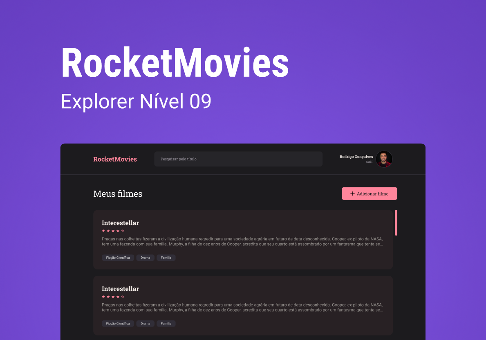
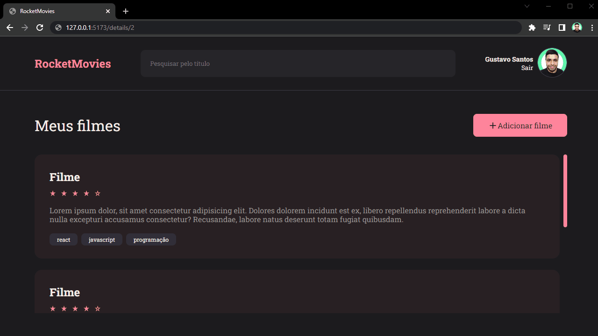

# :movie_camera: Rocketmovies Frontend

Esse projeto é a parte visual de uma aplicação para guardar, mostrar, editar e deletar filmes de um banco de dados.

<h1 align="center">
    
</h1>

## :open_book: Sumário

- [Pré-Visualização](#clapper-pré-visualização)
- [Aviso](#loudspeaker-aviso)
- [Sobre](#memo-sobre)
- [Tecnologias](#floppy_disk-tecnologias)
- [Funcionalidades](#hammer-funcionalidades)
- [Autor](#nerd_face-autor)

</br>

## :clapper: Pré-Visualização

<h1 align="center">
    
</h1>

</br>

## :loudspeaker: Aviso

- O projeto **está finalizado**, mas poderá ter melhorias no futuro.

- Você pode testar a aplicação [clicando aqui](https://rocketmovies2022.netlify.app/)

- Você também pode clonar o repositório, e executar a aplicação localmente.

</br>

## :memo: Sobre

Este é um dos projetos propostos no programa [Explorer da Rocketseat](https://www.rocketseat.com.br/explorer), os [detalhes estão aqui](https://efficient-sloth-d85.notion.site/Front-end-da-aplica-o-30a5132b30534255b238a8aa1b48c963), essa aplicação é o frontend de um sistema que faz o cadastro de usuários, e permite que esses usuários cadastrem, visualizem, editem e excluam anotações de filmes em um [backend](https://github.com/devgustavosantos/rocketmovies-backend).

</br>

## :floppy_disk: Tecnologias

- **ReactJS** - utilizado para construir as interfaces;
- **JS** - usado para fazer toda a lógica da aplicação;
- **Styled Components** - utilizado para fazer a estilização;
- **Git** - responsável por realizar o versionamento do código.
- **Vite** - usado para criar um projeto React;
- **NPM** - utilizado para realizar a instalação das dependências;

</br>

## :hammer: Funcionalidades

_OBS_: por enquanto a aplicação terá apenas navegação(apenas as interfaces), e não terá interatividade.

- [x] Login;
- [x] Criar conta;
- [x] Mostrar filmes Salvos;
- [x] Salvar um novo Filme;
- [x] Detalhar um Filme;
- [x] Atualizar um Filme;
- [x] Mostrar Perfil;
- [x] Atualizar Perfil;

</br>

## :bulb: Utilização

- Comece clonando o projeto:

```bash
  $ git clone https://github.com/devgustavosantos/rocketmovies-frontend.git
```

- Entre no diretório:

```bash
  $ cd rocketmovies-frontend/
```

- Instale as dependências:

```bash
  $ npm install
```

- Inicie um servidor local:

```bash
  $ npm run dev
```

- Se tudo der certo, você receberá uma mensagem parecida com essa:

```bash
  VITE v3.0.9  ready in 1989 ms

  ➜  Local:   http://127.0.0.1:5173/
  ➜  Network: use --host to expose
```

- Agora abra seu navegador no endereço que foi informado no `Local` para testar a aplicação.

---

_Esses são os recursos disponíveis nessa Aplicação, se algum recurso não funcionar como o esperado, verifique essa documentação e tente novamente._

_Caso precista, por favor,entre em contato com [devgustavosantos@outlook.com](mailto:devgustavosantos@outlook.com)._

## :nerd_face: Autor

Feito com :heart: por Dev Gustavo Santos :grinning: Veja meu [LinkedIn.](https://www.linkedin.com/in/devgustavosantos/)
